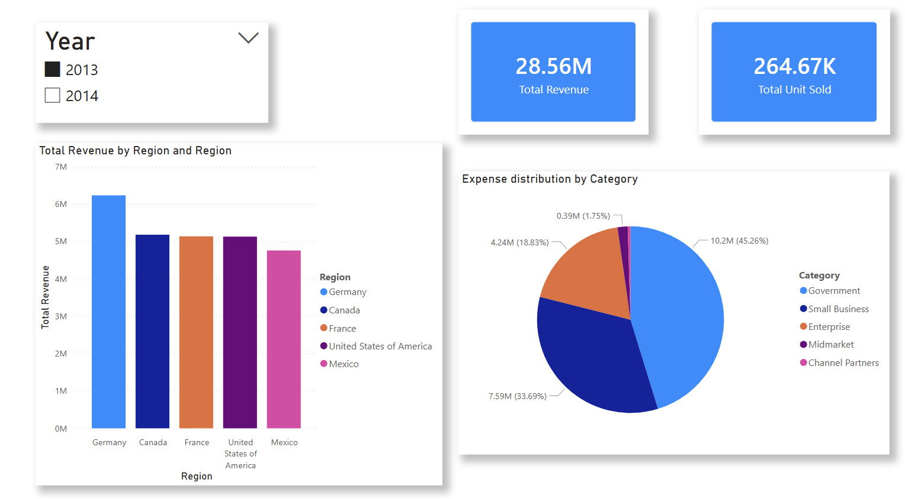

# 📊 Power BI Practice – Practice 1

---

## 📌 Overview
This task focuses on analyzing financial data using Power BI to answer key business questions related to revenue, expenses, sales volume, and trends over time.

The objective is to build clear and meaningful visualizations that help in understanding business performance.

---

## ❓ Business Questions
1. Which region has the highest revenue?  
2. How are expenses distributed by category?  
3. What is the total number of units sold?  
4. How have sales changed over the years?  

---

## 📊 Visualizations



---

## 🧰 Tools Used
- **Power BI**
- Data modeling  
- Basic DAX measures  
- Data visualization techniques  

---

## 📂 Project Structure

```text
Task-1/
│
├── Practice1.pbix               # Power BI dashboard file
├── Practice1.pdf                # Report with screenshots and explanations
├── financial_sample.xlsx        # Dataset used for analysis
├── image/                       # Dashboard screenshot
└── README.md                
```

---

## 🎯 What I Learned
- Creating dashboards using Power BI  
- Choosing appropriate visuals for business questions  
- Building KPI cards and summary metrics  
- Interpreting trends and distributions  

