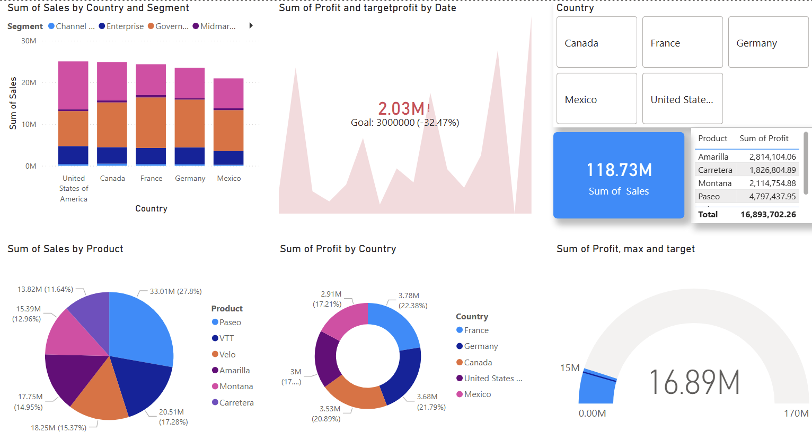

# 📊 Power BI Practice – Practice 2

---

## 📌 Overview
This task focuses on building an interactive Power BI dashboard to analyze sales and profit performance across different countries, products, and customer segments.

The dashboard combines multiple visualizations to provide a clear understanding of revenue trends, profitability, and performance against targets.

---

## 📊 Visualizations

### 📌 Dashboard Overview


---

### 🔍 Key Visuals Used
- **Stacked Bar Chart** → Sum of Sales by Country and Segment  
- **Area Chart** → Sum of Profit vs Target Profit over Date  
- **Slicer (Filter Panel)** → Country selection  
- **KPI Card** → Total Sales (118.73M)  
- **Pie Chart** → Sales by Product  
- **Donut Chart** → Profit by Country  
- **Gauge Chart** → Profit vs Target and Maximum  

---

## 📊 Insights
- Sales performance varies significantly across countries and segments  
- Certain products contribute a major share of total revenue  
- Profit trends show fluctuations over time when compared to targets  
- Some regions outperform others in profitability  
- Overall performance can be evaluated against predefined targets using the gauge chart  

---

## 🧰 Tools Used
- **Power BI**
- Data visualization techniques  
- KPI indicators and dashboard design  

---

## 📂 Project Structure

```text
Practice2/
│
├── Practice2.pbix        # Power BI dashboard file
├── financial_sample.xlsx # Dataset used for analysis
├── image/                # Dashboard screenshot
└── README.md             
```

---

## 🎯 What I Learned

- Designing multi-visual dashboards in Power BI
- Combining different chart types for better insights
- Using slicers for interactivity
- Representing targets using gauge and area charts
- Improving dashboard storytelling
