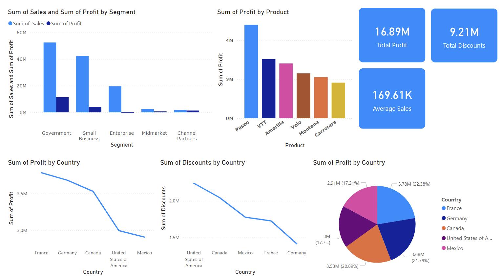

# 📊 Power BI Practice – Practice 3

---

## 📌 Overview
This task focuses on building an interactive Power BI dashboard to analyze profit, sales, and discount performance across different countries, products, and customer segments.

The dashboard combines multiple visualizations to provide a clear understanding of profitability distribution, discount patterns, and segment-level sales performance.

---

## 📊 Visualizations

### 📌 Dashboard Overview


---

### 🔍 Key Visuals Used
- **Grouped Bar Chart** → Sum of Sales and Sum of Profit by Segment
- **Bar Chart** → Sum of Profit by Product
- **Line Chart** → Sum of Profit by Country
- **Line Chart** → Sum of Discounts by Country
- **Pie Chart** → Sum of Profit by Country (with percentage breakdown)
- **KPI Card** → Total Profit (16.89M)
- **KPI Card** → Total Discounts (9.21M)
- **KPI Card** → Average Sales (169.61K)

---

## 📊 Insights
- The **Government** and **Small Business** segments generate the highest sales and profit compared to other segments
- **Paseo** is the top-performing product by profit, followed by VTT and Amarilla
- **France** leads in total profit by country, while **Mexico** has the lowest
- **United States of America** offers the highest total discounts, whereas **Germany** offers the least
- In terms of profit share, **France (22.38%)** and **Canada (21.79%)** contribute the most, while **Mexico (17.21%)** contributes the least

---

## 🧰 Tools Used
- **Power BI**
- Data visualization techniques
- KPI indicators and dashboard design

---

## 📂 Project Structure

```text
Practice3/
│
├── Practice3.pbix        # Power BI dashboard file
├── financial_sample.xlsx # Dataset used for analysis
├── Practice3.pdf         # Power BI report
├── image/                # Dashboard screenshot
└── README.md             
```

---

## 🎯 What I Learned

- Building multi-visual dashboards combining bar, line, and pie charts
- Comparing sales and profit side-by-side across segments using grouped bar charts
- Analyzing discount distribution across countries using line charts
- Using KPI cards to highlight key metrics at a glance
- Visualizing proportional profit contribution using pie charts with percentage labels