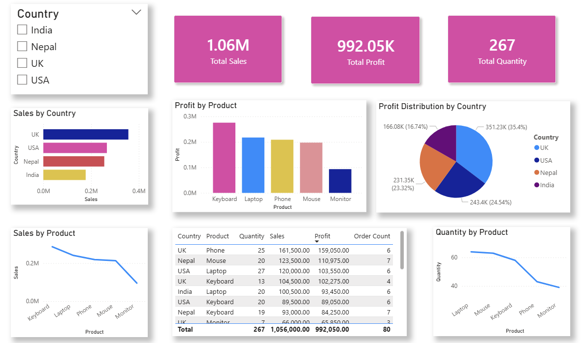

# 📊 Power BI Practice – Practice 4

---

## 📌 Overview
This project focuses on building an interactive Power BI dashboard to analyze sales, profit, quantity, and product performance across different countries and products.

The dashboard combines calculated fields, measures, and multiple visualizations to provide insights into revenue distribution, profitability, and sales trends.

---

## 📊 Visualizations

### 📌 Dashboard Overview


---

### 🔍 Key Visuals Used
- **KPI Card** → Total Sales  
- **KPI Card** → Total Profit  
- **KPI Card** → Total Quantity Sold  
- **Bar Chart** → Sales by Country  
- **Column Chart** → Profit by Product  
- **Pie Chart** → Profit Distribution by Country  
- **Line Chart** → Quantity by Product  
- **Line Chart** → Sales by Product  
- **Table Visual** → Detailed dataset (Country, Product, Quantity, Sales, Profit)  
- **Slicer** → Country Filter for interactive analysis  

---

## 🛠 Data Transformations

- Removed blank rows from dataset  
- Filtered out negative values in Quantity  
- Handled missing values using appropriate imputation methods  
- Standardized Country values:
  - Nep → Nepal  
  - Ind → India  
  - U.S.A → USA  
  - U.K → UK  
- Created calculated columns:
  - Sales = Quantity × Price  
  - Profit = Sales − Discount impact  

---

## 📊 Key Insights

- Sales performance varies significantly across countries, with some regions contributing higher revenue  
- Certain products generate higher profit compared to others  
- Quantity trends highlight demand variation across products  
- Profit distribution shows uneven contribution across countries  
- Country slicer enables dynamic filtering for deeper insights  

---

## 🧰 Tools Used
- Power BI  
- Power Query (Data Cleaning & Transformation)  
- DAX (Calculated Columns & Measures)  
- Data Visualization Techniques  

---

## 📁 Project Structure

```text
Practice4/
│
├── Practice4.pbix        # Power BI dashboard file
├── Product.xlsx          # Dataset used for analysis
├── image/                # Dashboard screenshot
└── README.md             
```

---

🎯 What I Learned

- Cleaning and transforming real-world datasets using Power Query
- Creating calculated columns for Sales and Profit analysis
- Using DAX measures for aggregations like total quantity and order count
- Designing interactive dashboards with multiple chart types
- Building insights using KPIs, filters, and trend analysis
- Structuring dashboards for clarity and business understanding