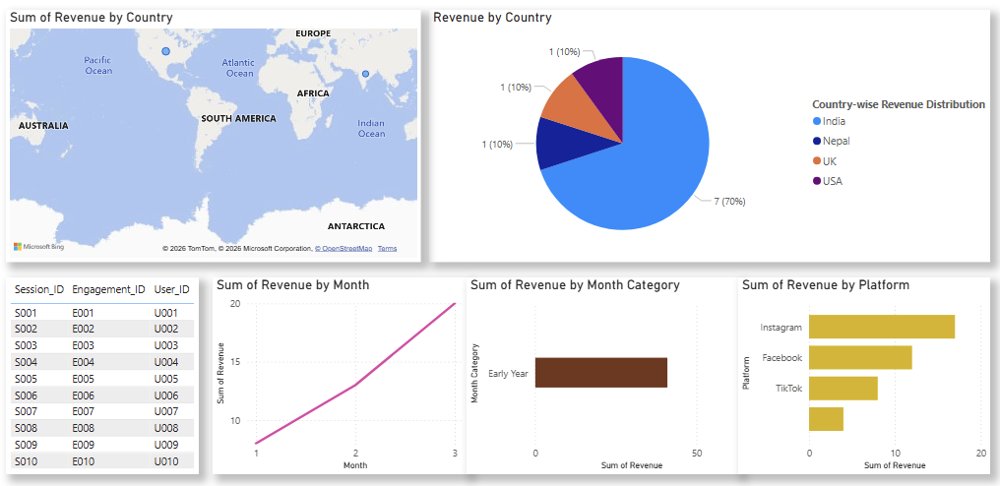

# 📊 Power BI Practice – Practice 5

## 📌 Overview

This practice focuses on **data preparation, relationship modeling, and visualization in Power BI**.  

It involves working with multiple datasets, cleaning data, creating relationships, and building insightful visualizations.

---

## 📸 Dashboard Preview


---

## 🎯 Objectives

- Import and clean multiple datasets  
- Verify and create relationships between tables  
- Perform data transformation using Power Query  
- Create calculated columns  
- Build visualizations for data insights  

---

## 🧩 Tasks Performed

### 📥 1. Data Import & Cleaning

- Imported `powerbi_relationship_dataset.xlsx`
- Loaded all three sheets into Power BI
- Checked for incorrect headers (headers appearing as data rows)
- Promoted first row to headers where necessary
- Cleaned and formatted data

---

### 🔗 2. Data Modeling

- Verified relationships in **Model View**
- Ensured correct connections between tables

#### ⚠️ Auto-Detect Fix (if not working)

- Go to:
  - **File → Options and Settings → Options**
  - **Current File → Data Load**

- Enable:
  - ✔️ *Autodetect new relationships after data is loaded*

---

### 🥧 3. Pie Chart Visualization

- Created a **Pie Chart**
- Displayed **Country-wise Revenue Distribution**
- Used:
  - Country → Legend
  - Revenue → Values

---

### 📈 4. Revenue Trend Analysis (Line Chart)

- Created a **Line Chart**
- X-axis: Month  
- Y-axis: Revenue (Sum)  
- Insight: Shows revenue trend over time

---

### 📊 5. Revenue by Month Category (Bar Chart)

- Axis: Month Category (Early Year, Mid Year, Late Year)  
- Values: Revenue (Sum)  
- Insight: Compares performance across time periods

---

### 📊 6. Revenue by Platform (Bar Chart)

- Axis: Platform  
- Values: Revenue (Sum)  
- Insight: Identifies best-performing platforms

---

### 📂 7. Social Dataset Transformation

- Imported `social.csv`
- Extracted:
  - Month from Date column  
  - Year from Date column  

#### ➕ Created Custom Column: Month Category

- Months 1–4 → Early Year  
- Months 5–8 → Mid Year  
- Months 9–12 → Late Year  

---

### 🗺️ 8. Data Cleaning & Map Visualization

- Fixed inconsistencies in Country names  
- Standardized values for accurate mapping  
- Created Map Visualization:
  - Location → Country  
  - Bubble Size → Revenue  
- Gained geographical revenue insights  

---

### 📊 9. User Activity Relationship Table

- Created table containing:
  - User_ID  
  - Session_ID  
  - Engagement_ID  

- Insight:
  Helps track user behavior across sessions and engagement activities, improving data relationship understanding.

---

## 📁 Files Structure

```
Practice5/
│
├── Practice5.pbix                        # Power BI dashboard file
├── powerbi_relationship_dataset.xlsx     # Dataset used for analysis
├── social.csv                            # Dataset used for analysis
├── image/                                # Dashboard screenshot
└── README.md       
```

---

## 📊 Visualizations

- 🥧 Pie Chart → Country-wise Revenue  
- 🗺️ Map → Revenue by Country  
- 📈 Line Chart → Revenue Trend by Month  
- 📊 Bar Chart → Revenue by Month Category  
- 📊 Bar Chart → Revenue by Platform  
- 📋 Table → User–Session–Engagement Data  

## 💡 Key Learnings

- Data cleaning in Power BI  
- Relationship modeling  
- Time-based analysis (Month, Year, Category)  
- Creating calculated columns  
- Building multi-level dashboards  
- Understanding user behavior through relational data  

