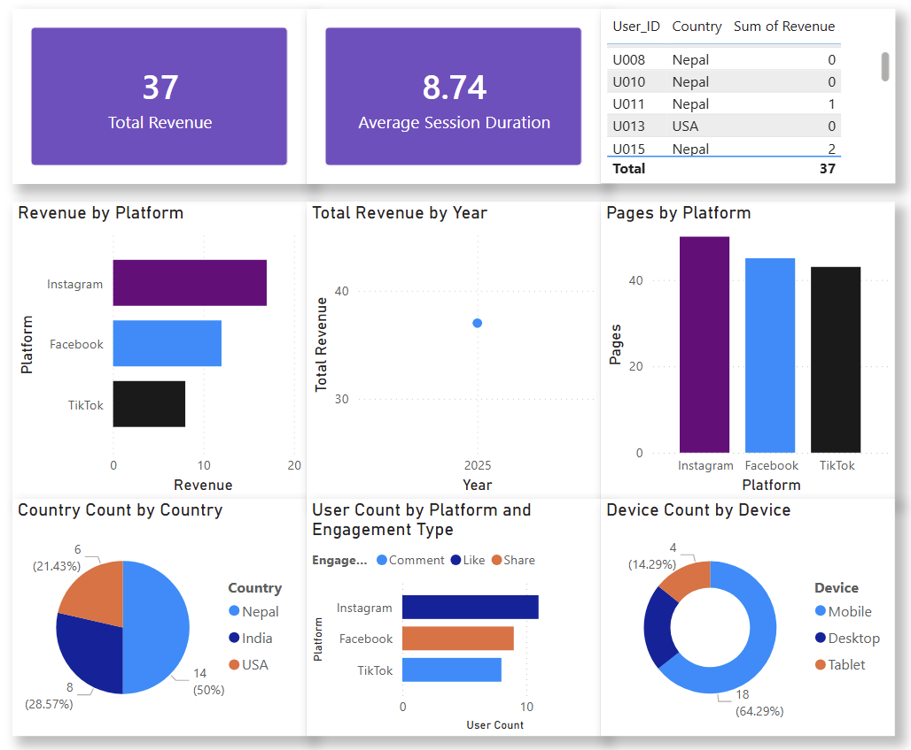

# 📊 Power BI Practice – Practice 6

## 📌 Overview

This practice focuses on **data cleaning, transformation, DAX measures, KPI creation, and dashboard design in Power BI**.  
The objective is to turn raw data into meaningful insights through structured visuals and calculations.

---

## 📸 Dashboard Preview


---

## 🎯 Objectives

- Clean and transform raw data  
- Handle missing and inconsistent values  
- Create calculated columns  
- Build DAX measures  
- Design KPIs and visualizations  
- Create a structured dashboard  

---

## 🧹 Data Preparation (Power Query)

### 📥 Data Loading
- Imported dataset into Power BI  
- Opened in **Transform Data (Power Query Editor)**  

---

### 🛠️ Data Cleaning

- Fixed missing values in **Platform** column  
- Standardized **Country** values  
  - Example: `"Nep"`, `"Nepal"` → `"Nepal"`  

---

### 🔄 Data Type Conversion

- Converted:
  - Date → Date  
  - Revenue → Whole Number  
  - Other fields adjusted as needed  

---

### 📅 Created Columns

- **Month** extracted from Date  
- **Year Category** column created:
  - 1–4 → Early Year  
  - 5–8 → Mid Year  
  - 9–12 → Late Year  

---

## 📐 DAX Measures

### 💰 Total Revenue

```DAX
Total Revenue = SUM('TableName'[Revenue])
```

---

### ⏱️ Average Session Duration

```DAX
Average Session Duration = AVERAGE('TableName'[Session Duration])
```

---

## 📊 KPI Indicators

- **Total Revenue (Card KPI)**  
- **Average Session Duration (Card KPI)**  

These KPIs provide quick, high-level insights into performance.

---

## 📊 Visualizations

- **Bar Chart** → Revenue by Platform  
- **Pie Chart** → Country distribution (count)  
- **Line Chart** → Revenue trend over Date  
- **Column Chart** → Pages Visited by Platform  
- **Stacked Bar Chart** → Engagement Type by Platform  
- **Donut Chart** → Device usage distribution  

---

## 📋 Table Visual

Displays:
- User_ID  
- Country  
- Revenue  

---

## 🧱 Dashboard Design

- Combined all visuals into a **clean layout**
- Maintained:
  - Proper spacing  
  - Logical grouping  
  - Visual balance  
- KPIs placed at the top for quick insights  

---

## 📁 Files Structure

```
Practice6/
│
├── Practice6.pbix             # Power BI dashboard file
├── social.csv                 # Dataset used for analysis
├── image/                     # Dashboard screenshot
└── README.md       
```

---

## 💡 Key Learnings

- Data cleaning using Power Query  
- Creating calculated columns  
- Writing DAX measures  
- Using KPI visuals effectively  
- Building structured dashboards  


