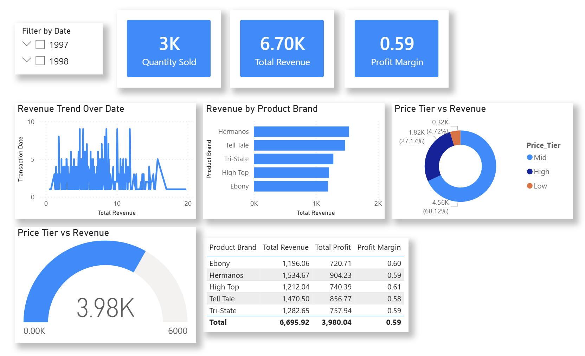

# 📊 Power BI Practice – Practice 7

## 📌 Overview

This practice focuses on **data cleaning, transformation, calculated columns, DAX measures, and dashboard design in Power BI**.  
The objective is to analyze product sales data and extract insights related to revenue, cost, profit, and pricing tiers.

---

## 📸 Dashboard Preview


---

## 🎯 Objectives

- Clean and transform raw product sales data  
- Handle missing and inconsistent values  
- Create calculated columns for analysis  
- Build DAX measures for business insights  
- Analyze revenue, cost, and profit performance  
- Design an interactive Power BI dashboard  

---

## 🧹 Data Preparation (Power Query)

### 📥 Data Loading
- Connected to **Product_Details CSV file**  
- Renamed table to **Products**  

---

### 🛠️ Data Cleaning

- Fixed data types:
  - product_id → Whole Number  
  - product_selling_price → Decimal Number  
  - product_cost_price → Decimal Number  
- Standardized Country values:
  - United States → USA  
  - United Kingdom → UK  
- Replaced null values in recyclable column with 0  

---

### 📐 Calculated Columns

- Price_Tier:
  - High → selling price > 3  
  - Mid → selling price > 1  
  - Low → otherwise  

- Revenue = quantity × selling price  
- Cost = quantity × cost price  

- Verified correct data types for all new columns  
- Applied changes using Close & Apply  

---

## 📐 DAX Measures

```DAX
Quantity Sold = SUM(Products[quantity])
Total Revenue = SUM(Products[Revenue])
Total Cost = SUM(Products[Cost])
Total Profit = [Total Revenue] - [Total Cost]
Profit Margin = DIVIDE([Total Profit], [Total Revenue])
```

---

## 📊 Visualizations

- Card Visuals:
  - Quantity Sold  
  - Total Revenue  
  - Profit Margin  

- Line Chart:
  - Revenue trend over time  

- Bar Chart:
  - Revenue by Product Brand  

- Donut Chart:
  - Price Tier vs Revenue  

- Gauge Chart:
  - Total Profit (Max: 6000, Target: 4000)  

- Table Visual:
  - Product Brand  
  - Total Revenue  
  - Total Cost  
  - Total Profit  
  - Profit Margin  

- Slicers:
  - Year  
  - Month  

---

## 📋 Dashboard Design

- Card visuals at the top for key metrics  
- Clean and structured layout  
- Interactive filtering using slicers  
- Balanced visualization design  
- Focus on clear business insights  

---

## 📁 Files Structure

```
Practice7/
│
├── Practice7.pbix
├── Product_Details.csv
├── image/
└── README.md
```

---

## ⚠️ Challenges Faced

- Handling inconsistent country values  
- Designing pricing tier logic  
- Writing correct DAX measures  
- Calculating revenue and profit accurately  
- Structuring dashboard layout  

---

## 💡 Key Learnings

- Power Query data transformation  
- Calculated columns in Power BI  
- DAX measures for business insights  
- Financial data analysis  
- Dashboard design principles  
